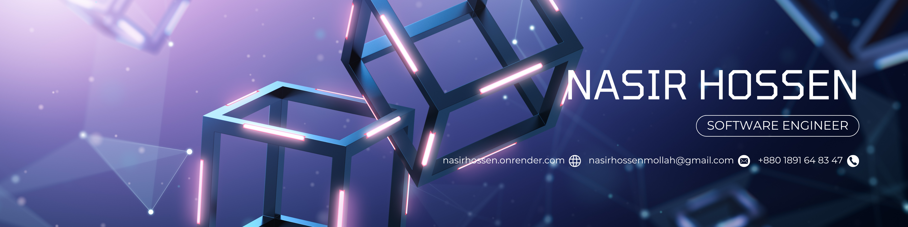

  

<h1 align="center">Hi 👋, I'm Nasir</h1>

  

## 👨‍💻 About Me
- 🔭 Building **full-stack web applications**
- 🌱 Currently learning **Full-Stack Development**
- 💻 Experienced with **Python, Django, React & Next.js**
- 🧠 Interested in **Backend Development, System Design & Scalable Web Apps**
- 🤖 Exploring **AI-Assisted Development & AI Engineering**
- ⚡ Love **Competitive Programming & Problem Solving**

## 🏆 GitHub Trophies

## 💻 Tech Stack

### 🎨 Frontend

### ⚙️ Backend

### 🗄️ Database

### 💻 Programming

### 🛠️ Tools & Version Control

## 📊 GitHub Stats

<table align="center" style="background-color: transparent; border: none;">
  <tr style="background-color: transparent;">
    <th style="background-color: transparent; border: none;">Stats</th>
    <th style="background-color: transparent; border: none;">Streak</th>
  </tr>

  <tr style="background-color: transparent;">
    <td style="background-color: transparent; border: none;">
      
    </td>
    <td style="background-color: transparent; border: none;">
      
    </td>
  </tr>

  <tr style="background-color: transparent;">
    <th colspan="2" style="background-color: transparent; border: none;">
      🔤 Top Languages
    </th>
  </tr>

  <tr style="background-color: transparent;">
    <td colspan="2" align="center" style="background-color: transparent; border: none;">
      
    </td>
  </tr>
</table>

<!-- Contribution Graph -->

  

<!-- Snake Game Repo View -->

  

---
